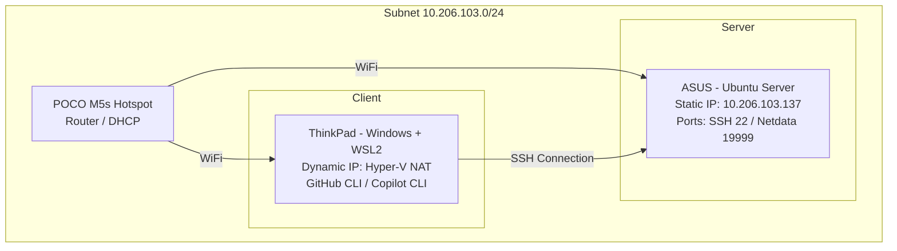

# Network Architecture and Devices

The laboratory network is set up using a mobile access point and organized within a private local subnet to enable communication between the server and the client without relying on the public internet.

## Connectivity
- **Medium:** Mobile Hotspot (POCO M5s)
- **Subnet:** `10.206.103.0/24`
- **Strategy:** Persistent SSH connection over a dynamically assigned wireless network from Client to local Server.

## Addressing and Interfaces Table

| Device | Role | Operating System | Interface | Local IP | Active Services |
| :--- | :--- | :--- | :--- | :--- | :--- |
| **ASUS** | Main Server | Ubuntu Server | `wlo1` | `10.206.103.137` | SSH (`22`), Netdata (`19999`) |
| **ThinkPad** | Client / Console | WSL2 (Ubuntu) | `eth0` | Dynamic | GitHub CLI, Copilot CLI |

## Network Topology

### How I resolved the connection

The solution was to keep the server within the hotspot's subnet and assign it a static local IP address that would not conflict with the router's DHCP. This allowed the client to access the server via SSH and validate internal services without relying on an external provider.

#### The main steps were:
- Confirming the hotspot network and subnet mask (10.206.103.0/24)
- Assigning a static IP to the server within that same subnet (10.206.103.137)
- Verifying connectivity using `ping` and `ip addr`
- Validating active ports using `ss -tulpn`
- Establishing a remote SSH connection from the client to the server

