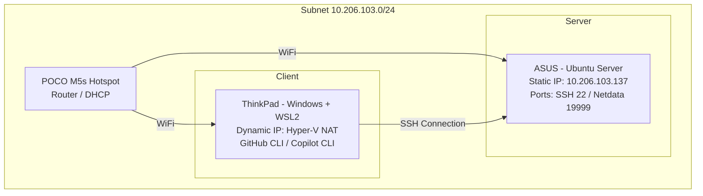

#  Network Architecture and Devices

## Network Topology

##  Addressing and Interfaces Table
| Device | Role | Operating System | Interface | Local IP | Active Services |
| :--- | :--- | :--- | :--- | :--- | :--- |
| **ASUS** | Main Server | Ubuntu Server | `wlo1` | `10.206.103.137` | SSH (`22`), Netdata (`19999`) |
| **ThinkPad** | Client / Console | WSL2 (Ubuntu) | `eth0` | Dynamic | GitHub CLI, Copilot CLI |